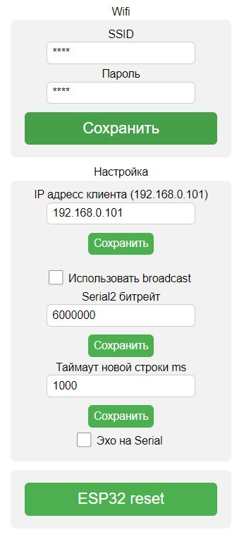

# esp8266_rtt

Проект переходника с UART в UDP пакеты для проекта отладчика на андроид
Есть вывод для сброса внешнего микроконтроллера
Проверена работа на UART 6 Мегабит
Есть нюансы с приемом Broadkast пакетов для сброса
Настройка через портал

